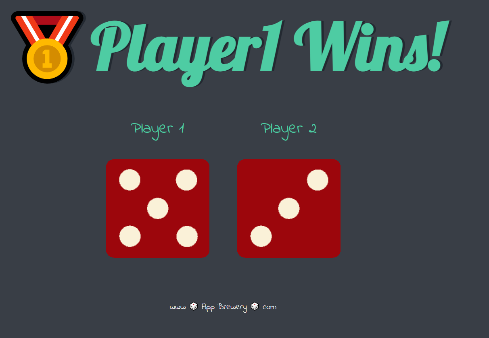
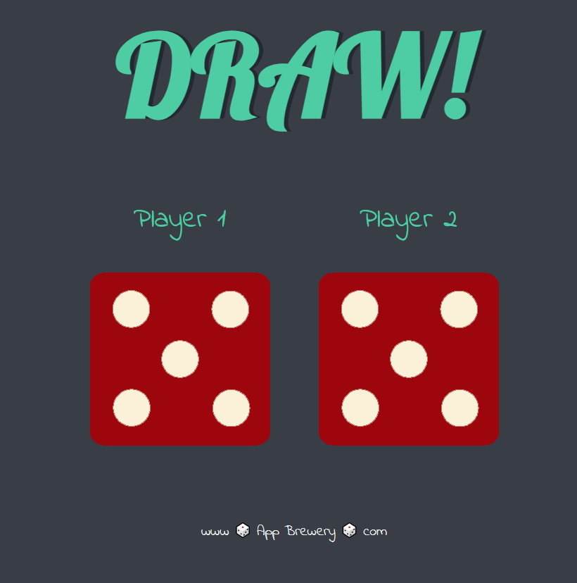

This porject is created for imporing my JS skills as a beginner. 

<h3>How it works?</h3>

This website game is works while refreshing itself. Everytime refreshing it, dice value will be change and it will compare every dicee values, depends on results, it will says which dice win. If there is equality then it will says "it draw situtaion." 
Here some example for every stuation in this website game.

<h4>Player 1 win</h4>

<h4>Player 2 wins</h4>

<h4>If there is draw</h4>

